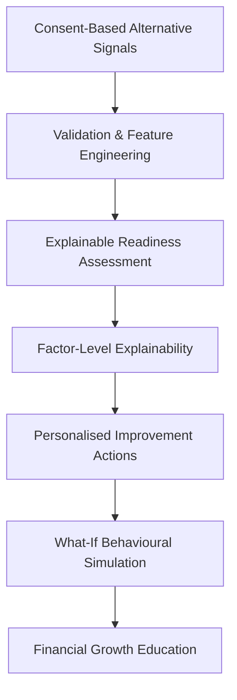

# PEHCHAAN

> Financial potential should be understood before it is overlooked.

PEHCHAAN is an explainable, consent-driven financial readiness platform that uses alternative behavioural financial signals to help underserved and thin-file individuals understand, improve, and build their financial readiness.

**Current Prototype:** Interactive frontend experience and FastAPI backend foundation  
**Planned Intelligence Layer:** ML-based readiness assessment and SHAP explainability

---

## 1. The Problem

Traditional financial assessments rely heavily on established credit histories—such as past loans, credit cards, and bureau records. However, this creates a structural barrier for:
- Thin-file individuals
- First-time borrowers
- Gig and informal-economy workers
- Financially underserved individuals

Millions of people demonstrate financial responsibility every day by consistently paying utility bills, maintaining stable recharges, and managing steady cash flows. Yet, they remain effectively invisible to formal financial institutions. **A lack of traditional credit history does not necessarily mean a lack of financial discipline or potential.**

## 2. Our Solution

PEHCHAAN bridges the financial inclusion gap by evaluating permitted, consent-based alternative financial and behavioural signals. 

We go beyond simply generating an opaque score. Our solution connects assessment with actionable guidance through a core journey:

- **UNDERSTAND**: Gain an explainable view of current financial readiness and the behavioural factors influencing it.
- **IMPROVE**: Receive personalised, actionable steps to strengthen financial habits and simulate potential outcomes.
- **GROW**: Build financial awareness and explore educational micro-investment pathways aligned with user readiness and risk context.

PEHCHAAN answers critical questions: *Where do I stand? Why? What should I improve? What could change if I improve?*

## 3. Who PEHCHAAN Is For

PEHCHAAN is designed for individuals who are actively participating in the economy but are overlooked by conventional financial systems:
- Thin-file individuals with limited or no formal credit history.
- First-time borrowers seeking to establish financial credibility.
- Gig economy workers with non-traditional income streams.
- Young adults taking their first steps into formal finance.

## 4. How PEHCHAAN Works

The platform operates on a clear, consent-driven data flow. 

*(Note: The current prototype demonstrates the complete product experience using structured mock data and includes a FastAPI backend foundation. The ML-based scoring model, SHAP explainability, production data pipelines, and full frontend-backend integration form the next implementation phase.)*



1. **Consent-Based Alternative Signals:** Ingest user-permitted utility, spending, and recharge data.
2. **Validation & Feature Engineering (Planned):** Process raw data into stable behavioural features.
3. **Explainable Readiness Assessment (Planned ML):** Evaluate financial discipline to generate a Credit Readiness Score.
4. **Factor-Level Explainability (Planned SHAP):** Reveal the specific behaviours driving the assessment.
5. **Personalised Improvement Actions:** Provide prioritised behavioural recommendations.
6. **What-If Behavioural Simulation:** Allow users to dynamically model how habit changes influence readiness.
7. **Financial Growth Education:** Recommend educational financial-foundation modules based on the user's risk context.

## 5. Core Product Capabilities

### Credit Readiness Assessment
- Interpretable Credit Readiness Score.
- Dynamic readiness status (e.g., Good, Needs Attention).
- Historical readiness trend visualization.

### Key Factors Exploration
- Transparent breakdown of behavioural factors shaping readiness.
- Clear identification of positive impacts and growth opportunities.
- Deep-linked connections between factors and recommended actions.

### Personalised Improvement Path
- Prioritised, step-by-step behavioural recommendations.
- Interactive status tracking (Not Started, In Progress, Completed).
- Clear explanations of *why* an action matters.

### What-If Simulator
- Interactive sliders modelling potential behavioural changes.
- Dynamic, real-time recalculation of projected readiness.
- Clear distinction between simulated projections and actual assessments.

### Financial Growth Education
- Risk-contextual educational pathways (Conservative, Moderate, Aggressive).
- Financial foundation checklists (e.g., Emergency funds, Insurance).
- Educational modules (No specific investment recommendations are made).

### Privacy & Consent Management
- Granular, user-controlled consent toggles for data sources.
- Transparent "Data Usage Flow" explanations.
- Clear warnings when disabling data limits assessment accuracy.

## 6. PEHCHAAN in Action

When a user joins PEHCHAAN, they explicitly consent to share alternative financial signals (like utility payments and recharge regularity). PEHCHAAN processes these behavioural patterns to generate a Credit Readiness Score. 

Rather than stopping at a number, the system explains *what* is helping or limiting the user's readiness. The user receives a personalised improvement path detailing actionable habits to adopt. Before taking action, they can use the **What-If Simulator** to model how sticking to a stable savings plan might improve their readiness over time. As their readiness strengthens, PEHCHAAN unlocks educational pathways to guide them toward responsible financial growth.

## 7. Why PEHCHAAN Stands Out

| Conventional Assessment Experience | PEHCHAAN |
| --- | --- |
| Primarily evaluates past formal credit history | Interprets everyday behavioural financial readiness |
| Score-focused and opaque | Explanation-focused and transparent |
| Limited user guidance | Personalised, actionable improvement pathway |
| Static assessment | Interactive What-If simulation modelling |
| Opaque decision factors | Explainability-first approach (Planned SHAP integration) |
| User as a passive subject | User as an active participant in their financial growth |

- **Beyond a Score:** Connects assessment → explanation → action → simulation → growth.
- **Explainability by Design:** Instead of a black box, factors influencing readiness are exposed to the user.
- **Improvement-Oriented:** Focused on helping users strengthen financial habits, not just evaluating them.
- **Consent-First:** Alternative signals are only used with explicit, revocable user consent.
- **Responsible Growth:** Connects readiness with financial education without presenting itself as a guaranteed loan approval or prescriptive advisory service.

## 8. Technical Architecture

PEHCHAAN's architecture is designed to be modern, scalable, and explainable.

**Current Implementation:**

The repository currently contains a fully interactive, stateful, and responsive **Next.js frontend prototype**, along with a **FastAPI backend foundation** featuring REST API routes, SQLAlchemy data models, Alembic migration support, demo data seeding, and a PostgreSQL-ready persistence architecture.

The current product experience is primarily powered by structured frontend mock data. Full frontend-backend integration, production data pipelines, and the ML-based intelligence layer remain part of the next development phase.

**Planned Intelligence Layer:**
- **AI/ML:** A machine-learning readiness assessment model for behavioural financial analysis.
- **Explainability:** SHAP (SHapley Additive exPlanations) for transparent, feature-level explanations of model outputs.
- **Production Integration:** End-to-end integration of the frontend, backend, persistent database, and intelligence pipeline.

## 9. Technology Stack

| Layer | Technology | Purpose | Status |
| --- | --- | --- | --- |
| **Frontend** | Next.js 16 | Application framework | Implemented |
| **Language** | TypeScript | Type-safe development | Implemented |
| **Styling** | Tailwind CSS | Responsive design system | Implemented |
| **Icons** | Lucide React | Consistent SVG iconography | Implemented |
| **Charts** | Recharts | Readiness and progress visualization | Implemented |
| **Persistence** | LocalStorage | Frontend prototype state management | Implemented |
| **Backend** | FastAPI | API and application services | Foundation Implemented |
| **Database** | PostgreSQL | Persistent structured data | Architecture Implemented |
| **AI/ML** | Python ML stack | Readiness assessment | Planned |
| **Explainability** | SHAP | Factor-level model explanations | Planned |

## 10. Current Frontend Implementation

The frontend prototype is fully interactive and presentation-ready. It includes:
- **One-screen Overview Dashboard:** A responsive, information-rich command centre designed to present core readiness insights without unnecessary navigation.
- **Responsive Application Shell:** Mobile sidebar drawers and adaptable layouts.
- **Interactive Simulator:** Dynamic, real-time score projection modelling.
- **Persistent State:** Local storage integration ensures user actions (like checking off improvement steps or modifying consent) persist across sessions.
- **Polished UI States:** Loading, empty, error, and not-found states are architecturally integrated.
- **Deep-Linked Workflows:** Notifications and dashboard widgets link directly to filtered, expanded views on detailed pages.

*(Note: The current prototype is powered by centralized frontend mock data to demonstrate the intended user experience prior to backend integration.)*

## 11. Project Structure

```text
PEHCHAAN/
├── frontend/                 # Next.js interactive frontend prototype
│   └── src/
│       ├── app/              # Application routes and product pages
│       ├── components/       # Reusable UI components and dashboard widgets
│       └── lib/              # Mock data, hooks, utilities, and API client
│
├── backend/                  # FastAPI backend foundation
│   ├── app/
│   │   ├── api/              # REST API routes
│   │   ├── core/             # Configuration and database setup
│   │   ├── models/           # SQLAlchemy data models
│   │   └── schemas/          # API validation and serialization schemas
│   ├── alembic/              # Database migration infrastructure
│   ├── tests/                # Backend API tests
│   └── seed_data.py          # Demo data seeding
│
├── documentation/            # Product and technical documentation
└── README.md                 # Project overview
```

## 12. Running the Interactive Prototype

The frontend provides the primary interactive demonstration of the current PEHCHAAN prototype. Follow these steps to run it locally.

### Prerequisites
- Node.js (v18 or higher)
- npm

### Installation & Setup

1. **Clone the repository:**
   ```bash
   git clone <repository-url>
   cd PEHCHAAN
   ```

2. **Navigate to the frontend directory:**
   ```bash
   cd frontend
   ```

3. **Install dependencies:**
   ```bash
   npm install
   ```

4. **Run the development server:**
   ```bash
   npm run dev
   ```

5. **Build for production:**
   ```bash
   npm run build
   npm run start
   ```

Open `http://localhost:3000` in your browser to interact with the platform.

> For backend setup and API-specific instructions, refer to `backend/README.md`.

## 13. Current Status & Roadmap

**Phase 1 — Interactive Frontend Prototype (Completed)**
- Complete interactive frontend prototype
- Responsive dashboard and detailed product pages
- Local mock-data architecture and frontend persistence
- Interactive simulation experience and consent controls

**Phase 2 — Backend & Data Foundation (Foundation Completed)**
- FastAPI application and REST API foundation
- SQLAlchemy domain models and PostgreSQL-ready architecture
- Alembic migration infrastructure
- Demo data seeding and backend API tests
- Frontend API client foundation

**Phase 3 — Integration & Readiness Intelligence (Next)**
- Full frontend-backend integration
- Production database deployment and persistence
- Authentication and consent-based data ingestion
- Feature engineering pipeline
- ML readiness assessment model
- SHAP-based explainability

**Phase 4 — Production Personalisation (Planned)**
- Data-driven personalised improvement recommendations
- Production-grade What-If simulation
- Risk-profile-based financial education pathways
- Production security, monitoring, and deployment

## 14. Responsible AI, Privacy and Safety

PEHCHAAN is built on foundational principles of ethical finance:
- **Explicit Consent:** Alternative signals are only accessed with explicit user permission.
- **Data Minimisation:** The platform strictly requests only the data necessary for readiness assessment.
- **Explainability:** AI outputs must be transparent; users deserve to know *why* they received a specific assessment.
- **Educational Framing:** All micro-investment features are strictly educational. PEHCHAAN does not guarantee financial outcomes or provide prescriptive investment advice.

## 15. Team

**Team: ABHIMANYU**
*(TetraTHON 2026, Indo-French AI Innovation Sprint, FinTech Track)*

| Team Member | Role |
| --- | --- |
| Shivansh Jani | Team Lead & Frontend Developer |
| Yajash Khamar | AI/ML & Explainability Developer |
| Harin Joshi | Backend & API Developer |
| Durgesh Singh | Database & System Architecture |
|  Aarchi Shah | Research, UI/UX & Testing |
